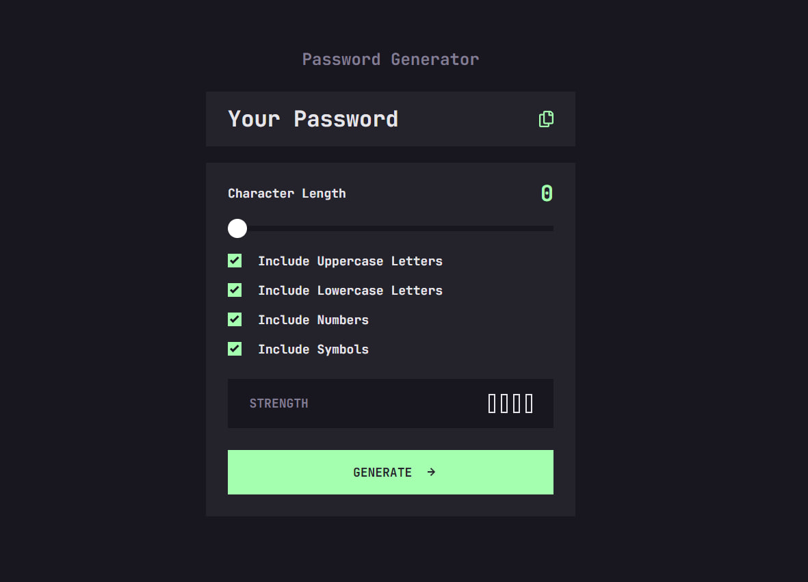

# Frontend Mentor - Password generator app solution

This is a solution to the [Password generator app challenge on Frontend Mentor](https://www.frontendmentor.io/challenges/password-generator-app-Mr8CLycqjh). Frontend Mentor challenges help you improve your coding skills by building realistic projects.

## Table of contents

-   [Overview](#overview)
    -   [The challenge](#the-challenge)
    -   [Screenshot](#screenshot)
    -   [Links](#links)
    -   [Built with](#built-with)
    -   [What I learned](#what-i-learned)
-   [Author](#author)

**Note: Delete this note and update the table of contents based on what sections you keep.**

## Overview

### The challenge

Users should be able to:

-   Generate a password based on the selected inclusion options
-   Copy the generated password to the computer's clipboard
-   See a strength rating for their generated password
-   View the optimal layout for the interface depending on their device's screen size
-   See hover and focus states for all interactive elements on the page

### Screenshot



### Links

-   Solution URL: (https://lanastazi-codes.github.io/Code-Generator/)

### Built with

-   Semantic HTML5 markup
-   CSS
-   Flexbox
-   CSS Grid
-   Desctop-first workflow
-   pure JavaScript

### What I learned

Here is a list of things I learned from this project:

-   how to build a "copy" function:

```js
clipboard.addEventListener("click", () => {
    const textarea = document.createElement("textarea");
    const password = result.innerText;
    if (!password) return;
    textarea.value = password;
    document.body.appendChild(textarea);
    textarea.select();
    document.execCommand("copy");
    textarea.remove();
    alert("Password coppied to clipboard");
});
```

-   Learned a lot on how to style inputs with range type, using pseudo-elements:

```css
  /* representing a slider thumb for chrome */
  ::-webkit-slider-thumb
  /* representing a slider thumb for mozila*/
  ::-moz-range-thumb
```

-   In this project I used two methods to compare string with specific symbols, first was using prototype.match:

```js
if (password.match(/([a-z].*[A-Z])|([A-Z].*[a-z])/)) {
    strength = strength + 1;
}
```

-   And from the second method I learned to make an array of numbers representing a key code

```js
const characterCodes = Array.from(Array(26)).map((_, i) => i + 97);

const lowercaseLetters = characterCodes.map(
    (code) => String.fromCharCode(code) // and make them real letters
);
```

## Author

-   Frontend Mentor - [@Lanastazi-codes](https://www.frontendmentor.io/profile/Lanastazi-codes)
-   Github - [@yourusername](https://github.com/Lanastazi-codes)
